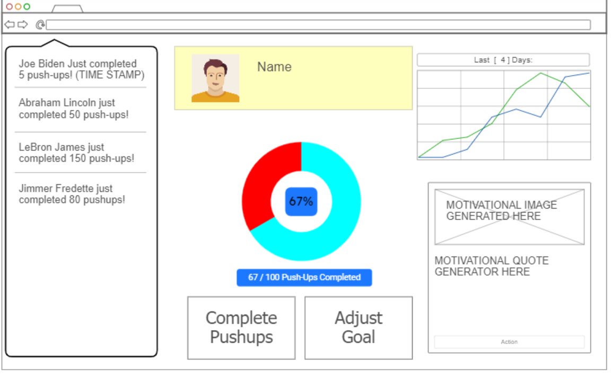

### Elevator Pitch
**extrapushups.com**

This website will track how many pushups you do every day. It is extremely simple and easy to use. Sign up, and instantly set a daily goal for pushups, and track it everyday. The service will give you daily motivational quotes, and notifies you when other users complete their pushups. It also has a statistical analysis section, where you can find your daily average, and your grand total of pushups completed.

### Key Features
- Secure login over HTTPS
- Ability to select desired amount of pushups to decide
- Other Users completed pushups automatically posted and displayed
- Statistical Tracking:
    -Average amount of pushups over x amount of days
    -Grand Total of pushups completed all time.
- Motivational Quotes and pictures automatically re-generated every time you log in
  
### Technologies
    **HTML** - Uses correct HTML structure. One page for login and one for tracking.
    **CSS** - Engaging colors and design for professional looking webpage.
    **React** - Provides login, tracker display, Goal setting display.
    **Service** - Backend service with endpoints for:
        login
        retrieving goals and pushups completed
        submitting pushups
        retrieving other users pushup completions
    **DB/Login** - Store users, goals, and pushups in database. Register and login users. Credentials securely stored in database.
    **WebSocket** - As each user does pushups, their numbers are broadcast to all other users.

## HTML deliverable
## CSS deliverable
## React deliverable
## Service deliverable
## DB/Login deliverable
## WebSocket deliverable
